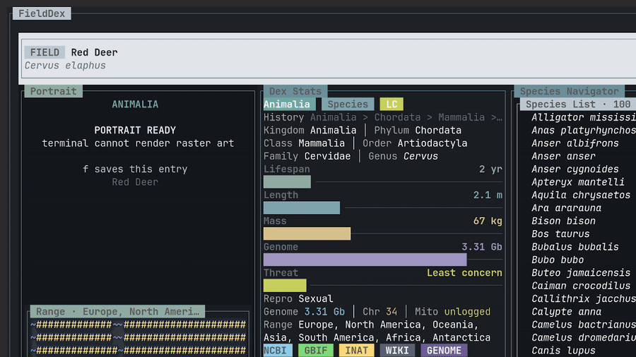

# BioDex

BioDex is a terminal-native species atlas: part field guide, part taxonomy browser, part cached research notebook.

It opens into a fast three-pane TUI with species portraits, range maps, lineage history, compact biological stats, and two ways to browse: a curated A-Z species list or a taxonomy tree.

## Demo

[](assets/biodex-demo.mp4)

Click the preview to open the full demo clip.

## Highlights

- Browse a curated 100-species starter pack with local cached data
- Move through species alphabetically, with auto-loading as you pause on entries
- Switch into taxonomy mode when you want to explore by kingdom, phylum, class, order, family, genus, and species
- View portraits, range maps, lineage, genome metadata, conservation status, and life-history stats in one terminal screen
- Reuse cached SQLite data so repeat browsing stays fast and mostly offline

## Install

BioDex is currently built from source.

```bash
git clone https://github.com/Jakeelamb/BioDex.git
cd BioDex
cargo build --release
```

Run the optimized binary:

```bash
./target/release/biodex
```

Optionally install it locally so `biodex` is available on your PATH:

```bash
cargo install --path .
```

Open a specific species:

```bash
./target/release/biodex "Homo sapiens"
```

Run from source without keeping a release binary:

```bash
cargo run --release -- "Panthera leo"
```

## Requirements

- Rust toolchain
- A modern terminal
- An image-capable terminal for portraits and raster range maps; otherwise BioDex falls back to text placeholders

## Common Commands

The examples below assume `biodex` is on your PATH. If not, use `./target/release/biodex` from the repo root.

- `biodex`: open the TUI at `Animalia`
- `biodex "Ailuropoda melanoleuca"`: open a species directly
- `biodex --text "Homo sapiens"`: print species data without launching the TUI
- `biodex --prefetch`: seed the default 100-species hot cache
- `biodex --prefetch-animals`: refresh curated Animalia candidates and cache media
- `biodex --import-backbone`: import the GBIF backbone for offline taxonomy search, roughly 200 MB
- `biodex --cache-all-rich`: run a long resumable sweep for richer cached species rows
- `biodex --stats`: show local cache statistics

## Controls

- `↑/↓` or `j/k`: move through the active navigator
- `t`: switch between the A-Z species list and taxonomy browser
- `Enter` / `l` / `→`: open the selected entry
- `h` / `←`: move up a taxonomy level
- `/`: search
- `r`: refresh from live sources
- `f`: toggle saved status
- `?`: help
- `q` / `Esc`: quit or close the active panel

## Data Sources

BioDex merges public data from several sources and caches the result locally:

| Source | Used for |
| --- | --- |
| GBIF | Taxonomy matching, backbone import, occurrence counts, continent/range data, and raster map overlays |
| NCBI | Taxonomy IDs, lineage, and genome metadata when available |
| iNaturalist | Preferred species portraits when available |
| Wikipedia | Summaries, descriptions, and fallback life-history extraction |
| Wikidata | Conservation status, aliases, rank hints, and structured life-history fields |
| Ensembl | Supplementary genome statistics when available |
| Ollama | Optional local pass to fill missing life-history fields from cached article text |
| Local curated pack | Starter metadata for the 100-species browsing set |

## Caching

BioDex stores its local database and media cache under `biodex` app directories. Species rows, portraits, and range maps are cached after fetch, and the curated browser is designed to feel instant after `biodex --prefetch`.

Offline taxonomy search depends on the GBIF backbone import:

```bash
biodex --import-backbone
```

That import is larger than the normal starter cache, but it makes search and taxonomy navigation much more useful without repeated network calls.

## Status

BioDex is early but usable. The current focus is a fast, polished terminal atlas with strong cached browsing. Future directions include broader curated packs, better offline packaging, and an optional nostalgic desktop/window-shell presentation.

## License

BioDex source code is licensed under the MIT License. See [LICENSE](LICENSE).

Species data, images, range maps, and other third-party content fetched or cached by BioDex are not relicensed by this repository and remain subject to the terms of their original sources.
